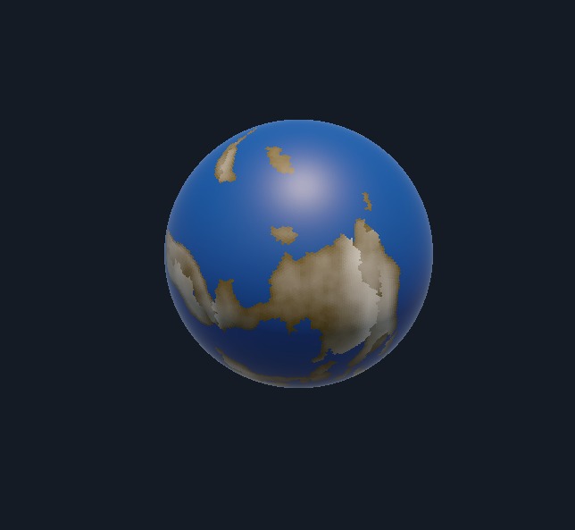

# Globe — Procedural Tectonics & Terrain (Unity)



> One-shot plate kinematics + layered visualization (continents, stress, noise) on a geodesic dual-mesh sphere in Unity.

---

## Overview

This project generates tectonic plates on a sphere, computes **relative-motion stress** at plate boundaries in a single pass (no time simulation), and visualizes different fields:

* **Continents** — colors by plate type (continental vs oceanic)
* **Stress** — red (convergent) ↔ gray (transform) ↔ blue (divergent), with adjustable spatial falloff
* **Noise** — static fBm noise field for visual richness
* **Combined** — simple scalar composition:

  * Continental: `value = oceanHeight + noise + stress`
  * Oceanic: `value = max(0 + noise + stress, oceanHeight)`

All rendering is driven through mesh **vertex colors**.

---

## Features

* Spherical Voronoi partitioning into plates (balanced growth seeding)
* Per-plate Euler poles & angular speeds → per-cell velocities
* One-shot **kinematic stress** (no stepping) with controllable **spatial falloff**
* Per-plate-decorrelated fBm noise (static, normalized)
* Toggleable view modes: Continents / Stress / Noise / Combined

---

## Requirements

* Unity (LTS recommended).
* Built-in Render Pipeline (Shader Graphs provided: `PlateColorLit.shadergraph`, `VC_Displace_Lit.shadergraph`).

> If your Unity version differs, shaders may need reimport/upgrades.

---

## Getting Started

1. **Clone**

   ```bash
   git clone <your-repo-url>.git
   ```
2. **Open in Unity** (use an LTS version if possible).
3. In the scene, ensure there’s a **GeodesicDualSphere** GameObject with a **PlateSystem** component attached.
4. Click **Reseed Plates** on `PlateSystem` to initialize.
5. Switch **View Mode** (Inspector) between: `Continents`, `Stress`, `Noise`, `Combined`.

### Useful Controls (if present)

* `OrbitCameraController` — drag to orbit, scroll to zoom.

---

## Key Scripts

* **`Globe/Tectonics/PlateSystem`** *(partial class split)*

  * `PlateSystem.cs` — MonoBehaviour & Inspector fields, lifecycle, reseed, orchestration.
  * `PlateSystem.Layers.cs` — data layers (stress / noise) + adapters to the stress module.
  * `PlateSystem.Rendering.cs` — writes vertex colors for each view mode.

* **`Globe/Tectonics/PlateKinematicStress.cs`**

  * Interfaces: `IDualMesh`, `IPlateState`
  * `Compute(...)` with `StressOptions { blurIterations, clipQuantile }`
  * Returns normalized stress per cell in `[-1, +1]`.

* **Mesh/Topology**

  * `GeodesicDualSphere`, `GeodesicBuilder`, `DualBuilder`, `Topology`, `Geodesic` — sphere topology + dual mesh.
  * `PlateTypes.cs` — plate config/state containers & partition utilities.


---

## Roadmap

* Value-curve mapping for stress (sigmoid/gamma/custom)
* Time-varying noise/weather overlays
* Blend presets (e.g., “Crisp Plates”, “Soft Tectonics”)
